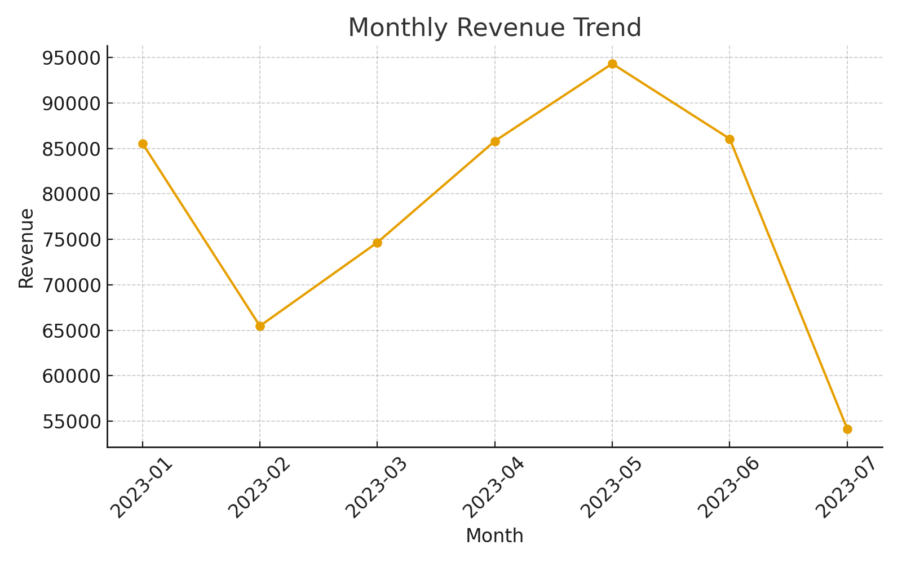
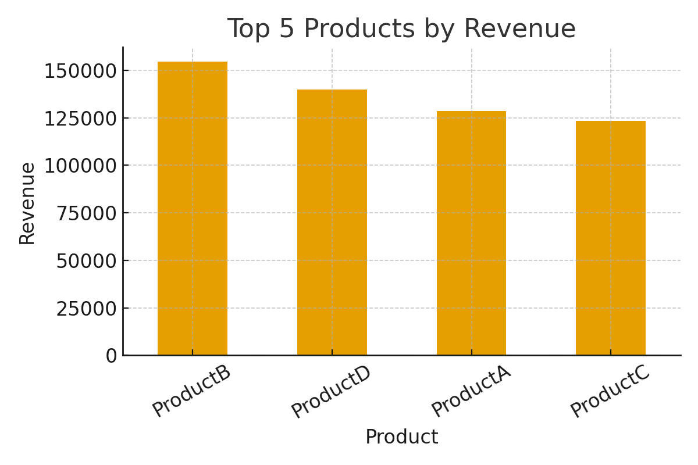
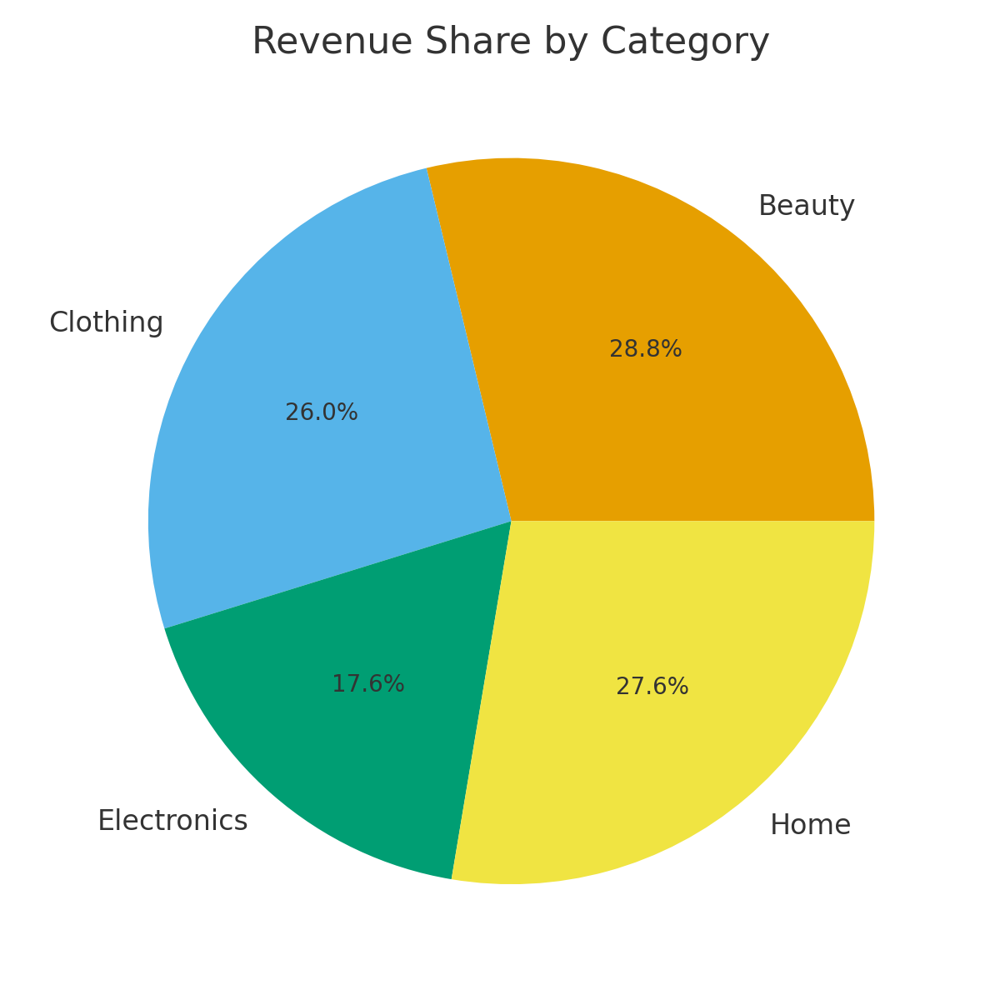

# Business Analytics Projects  

This repository contains some of my practice projects where I applied SQL, Excel, and Python to analyze business data.  
The idea is to showcase how I can work with raw data, build dashboards, and use statistics to generate useful insights.  

## Projects  

### 1. Sales Data Analysis (SQL + Excel)  
- Used a sales dataset (`sample_sales_data.csv`).  
- Wrote SQL queries (see `queries.sql`) to find revenue trends, top products, and average order values.  
- Exported results to Excel and created pivot tables/charts to track KPIs like monthly revenue and category performance.  

### 2. Customer Retention Dashboard (Excel)  
- Looked at customer order behavior to understand repeat purchases and churn.  
- Built an Excel dashboard (steps in `dashboard_instructions.txt`) using pivot tables and slicers.  
- The dashboard makes it easy to filter by region/category and check retention metrics.  

### 3. Statistical Analysis (Python)  
- Jupyter Notebook (`analysis.ipynb`) where I applied regression and probability models on the same dataset.  
- Tried to predict revenue using Quantity & Price.  
- Plotted data distributions and regression lines to understand patterns.  

## Tools & Technologies  
- SQL (SQLite syntax)  
- Excel (Pivot tables, charts, dashboard building)  
- Python (Pandas, Matplotlib, Seaborn, scikit-learn)

## PowerBI Dashboard

- [Download Interactive Dashboard (.pbix)](PowerBI/Business_Analytics_Dashboard.pbix)

### Dashboard Preview

Monthly Revenue Trend

Top 5 Products by Revenue

Revenue Share by Category

Dashboard Layout

## How to Explore  
1. Open `queries.sql` to check sample SQL queries.  
2. Open `sample_sales_data.csv` to view the dataset.  
3. Read `dashboard_instructions.txt` to recreate the Excel dashboard.  
4. Open `analysis.ipynb` directly on GitHub to see Python code and plots.  

